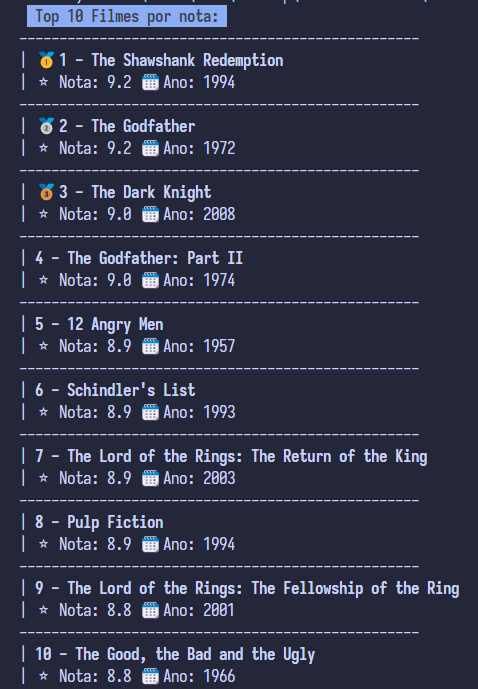

# Imersão Alura aula 01

Simples projeto para mostrar os Top10 filmes no terminal de maneira formatada, tambem com a possibilidade de exibir as top series ou por popularidade com pequenas alterações no codigo.

## Referencias
- [API top Filmes](https://raw.githubusercontent.com/alura-cursos/imersao-java-2-api/main/TopMovies.json)
- [Explicando Emojis a partir do valor Hexadecimal](https://stackoverflow.com/questions/5585919/creating-unicode-character-from-its-number)
- [EmojiTera(Codigos e hexadecimais dos emojis)](https://emojiterra.com/pt/)
- [Decoração Basica do terminal](https://www.alura.com.br/artigos/decorando-terminal-cores-emojis)